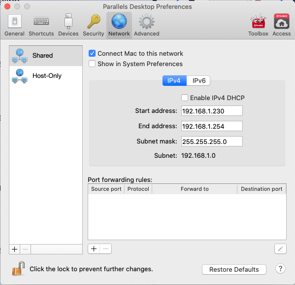
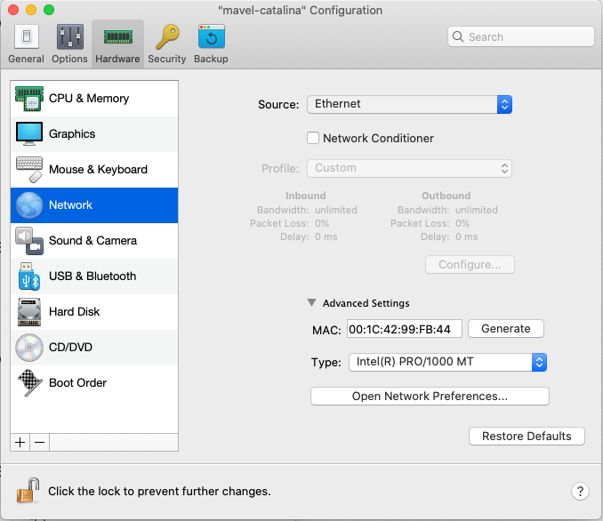
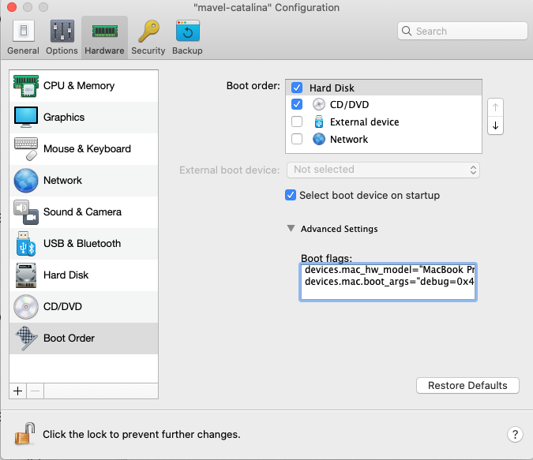

# How to debug a KEXT on a Catalina Parallels VM over a network connection

## Topology

1) VM - a virtual machine where you install and run a KEXT
2) Host - a dev machine where you run debugger

VM must be on Ethernet (not wireless), both VM and Host must be on the same subnet.

## VM setup

### Network configuration

Create a VM, make sure it is on a Shared network (I created a dedicated Ethernet configuration):




Start VM, run ifconfig and write down the active Ethernet interface name (where you have an IP assigned, and which is on the same subnet as your Host, I'll call it `kdp_match_name`) and the IP address.

### Debugger

Install XCode command line developer tools (`xcode-select --install`)

Download macOS Kernel Debug Kit from https://developer.apple.com for the installed OS version (Run `sw_vers | grep ProductVersion`, and use only the KDK for this version).
For example, if you have Catalina 10.15.7, search for [Kernel Debug Kit 10.15.7](https://developer.apple.com/download/all/?q=Kernel%20Debug%20Kit%2010.15.7). Note that you'll need to install the same package, for the same version on your Host.

### Recovery mode

Reboot into the recovery console, start Terminal and copy the kernel.development file.
(You can do it only in the recovery mode!). Also, make sure that SIP is disabled. Shutdown the machine.

```bash
csrutil disable
cp /Volumes/Macintosh\ HD/Library/Developer/KDKs/<KDK Version>/System/Library/Kernels/kernel.development /Volumes/Macintosh\ HD/System/Library/Kernels/
shutdown -h now
```

### Boot arguments

You need to change boot args for the VM. You use `nvram boot-args` on a physical machine, but it does not work on a Parallels VM. Instead, you change them by updating Boot flags in the machine's properties (can be done only when the VM is stopped):



They will look like below:

```
devices.mac.boot_args="debug=0x44 kext_dev_mode=1 kcsuffix=development pmuflags=1 kdp_match_name=en0 wdt=-1"
```

Use your Ethernet interface instead of en0 (`kdp_match_name` from the Network configuration step above).

`debug=0x44` defines when a VM will fall into the debugger. There are different flags for different purposes.

`debug=0x44` means - KEXT will run as usually, at least either an exception crashes the VM, or you manually trigger an NMI.

### Boot VM

Reboot a machine, and mke sure it is ready to be debugged.

`uname -a` must mention `DEVELOPMENT`, for example:

```
mavel-catalina:~ testuser$ uname -a
Darwin mavel-catalina 19.6.0 Darwin Kernel Version 19.6.0: Thu Oct 29 22:56:44 PDT 2020; root:xnu-6153.141.2.2~1/DEVELOPMENT_X86_64 x86_64
```

While you cannot change boot arguments with `nvram`, you can verify that they were applied:

```
mavel-catalina:~ testuser$ nvram boot-args
boot-args	debug=0x44 kext_dev_mode=1 kcsuffix=development pmuflags=1 kdp_match_name=en0 wdt=-1
```

Install the KEXT that you want to debug, rebuild the KEXT cache, and reboot:

```
sudo kextcache -invalidate /
sudo reboot
```

## Host setup

Install XCode command line developer tools (`xcode-select --install`)

Install the same KDK as you installed on the VM (it must match the version of the VM, not the Host!)

Tell lldb to use Python 2: `defaults write com.apple.dt.lldb DefaultPythonVersion 2`

## Debugging

To immediately halt the VM, run `dtrace` (It will generate an NMI. You can run a key combination on a physical keyboard too, unless you are on a VM like me):

```
mavel-catalina:~ testuser$ sudo dtrace -w -n "BEGIN { breakpoint(); }"
dtrace: description 'BEGIN ' matched 1 probe
```

At this moment the VM freezes. You cannot move windows, you cannot type anything, the mouse cursor does not move. And you can connect to the VM from the Host now!

Start lldb:

```
mavel-catalina:~ testuser$ lldb /Library/Developer/KDKs/*KDK Version*/System/Library/Kernels/kernel.development
```

Debugger will tell you to load kernel.py. Do as suggested:

```
(lldb) command script import "/Library/Developer/KDKs/*KDK Version*/System/Library/Kernels/kernel.development.dSYM/Contents/Resources/Python/kernel.py"
```

Connect to VM using its IP address. This is the step that establishes an actual connection. On success, you will see running output and information about the VM's kernel:

```
(lldb) kdp-remote 192.168.1.182
```

Once connected, you can use all lldb's commands to debug the stopped VM, i.e. run `thread backtrace` to see where it got stopped. In case of a KEXT crash it will be a stack trace of where an exception was raised. However, it will contain only macOS kernel's symbols, not your KEXT symbols. To load KEXT symbols, load them from the executable file of your KEXT bundle:

```
(lldb) addkext -F /Users/mavel/repo/gitrepo/build/src/kernel/macos/mykext.kext/Contents/MacOS/mykext
```

If you stopped the VM via an NMI "breakpoint", you may continue execution now (that would unfreeze the VM):

```
(lldb) c
```

When done, detach the debugger:
```
(lldb) detach
```

## If you made a change in KEXT...

Once you made a change in your KEXT, you will install it to the VM to find out if the bug is fixed. Remember to rebuild the cache and reboot the VM before connecting the debugger again!

```
sudo kextcache -invalidate /
sudo reboot
```

**NB:** I noticed that for some reason macOS loses the boot args after these manipulations, and lldb cannot connect to the VM from the host. (Even though the VM properties show the correct Bool flags in the Parallels UI, but `nvram boot-args` tells differently). To correct it, I change the boot flags in Parallels UI by adding an extra new line (or removing it), and booting again. It always resolves the issue for me.

## Resources

- [https://knight.sc/debugging/2018/08/15/macos-kernel-debugging.html](https://knight.sc/debugging/2018/08/15/macos-kernel-debugging.html)
- [https://www.offensive-security.com/offsec/kernel-debugging-macos-with-sip/](https://www.offensive-security.com/offsec/kernel-debugging-macos-with-sip/)
- [https://ddeville.me/2015/08/kernel-debugging-with-lldb-and-vmware-fusion/](https://ddeville.me/2015/08/kernel-debugging-with-lldb-and-vmware-fusion/)